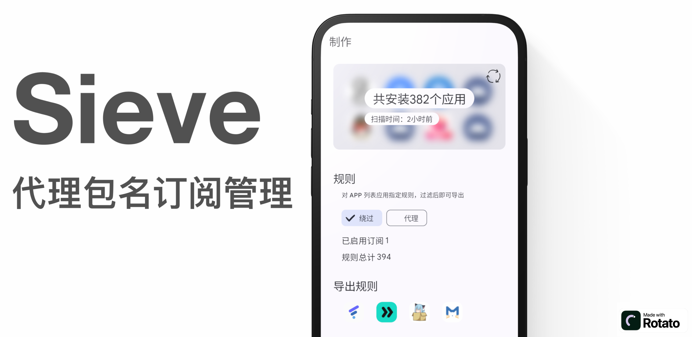
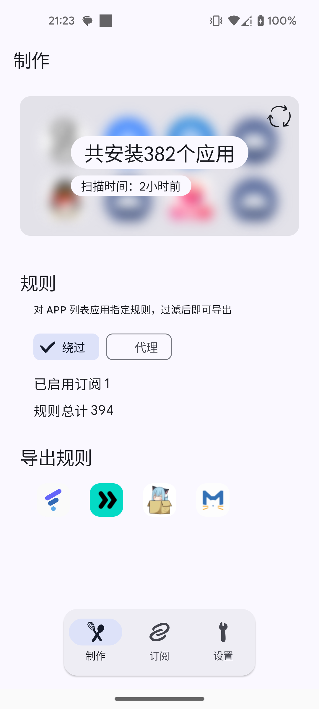
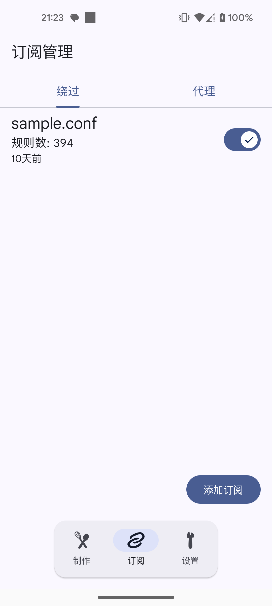
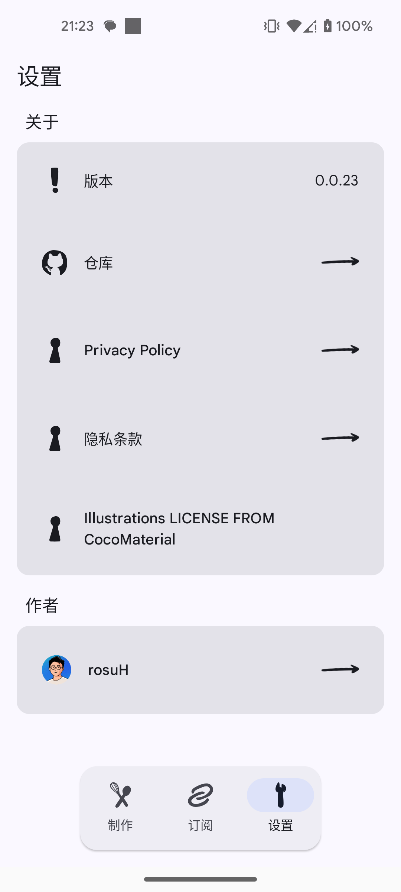

# Sieve

Sieve 旨在帮助用户更好地管理代理软件的应用过滤规则。

  

## 如果你也有类似困扰...🙁

在 Android 设备上使用代理软件时，某些应用可能会检测代理状态并限制功能。代理软件通常提供按应用程序包名绕过或强制代理的功能。然而，维护这些包名列表可能很繁琐，且不同代理软件可能使用不同的格式。

### Sieve 旨在简化这个过程，提供一个统一的界面来管理和导出这些规则。

## 主要功能

- 下载和管理代理规则订阅
- 扫描设备上安装的应用程序
- 将下载的规则与本地应用列表匹配
- 支持绕过模式和代理模式
- 导出匹配结果，支持多种代理软件格式
- 用户友好的界面，便于管理规则和订阅

  
  
  

## 致谢

- [CocoMaterial](https://cocomaterial.com/) - 提供了应用中使用的插图
- 部分资源使用 [Rotato](https://rotato.app/) 制作
## 隐私政策

请查看我们的 [隐私政策](https://raw.githubusercontent.com/rosuH/Sieve/master/PRIVACY.md)